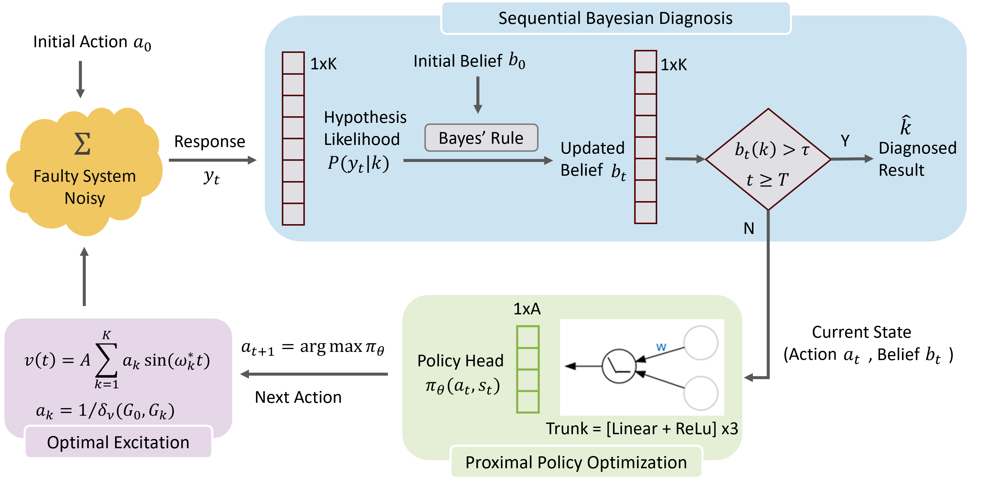

# netfd

Active fault diagnosis for networked LTI systems, bridging control-theoretic
identifiability analysis (Vinnicombe's ν-gap metric) and sequential
decision making (PPO).

The core idea is two-phase:

- **Offline (ν-gap-informed probe design).** For each candidate
  injection/observation pair, the pointwise chordal distance ψ(ω) between
  the nominal plant and every fault hypothesis identifies the
  most-informative excitation frequencies. A multi-sine probe weighted by
  inverse detectability is built from those peaks.
- **Online (sequential Bayesian diagnosis with a learned sequencer).** A
  PPO agent picks which (injection, observation) pair to excite at each
  step. The environment runs a Bayesian posterior update on the
  time-domain residual; the reward combines information gain, a
  belief-weighted ν-gap separability penalty, and a per-step cost.

The codebase reproduces three single-shot arguments and three PPO main
results on a 9-node benchmark network combining series, parallel,
feedback, and isolated-spoke sub-structures.

---

## Framework



---

## Installation

```bash
git clone https://github.com/<you>/netfd
cd netfd
pip install -e .
```

`pip install -e .` exposes `netfd` as an importable package. The
experiment scripts also work without installation via a `sys.path`
bootstrap.

Dependencies: `numpy`, `scipy`, `matplotlib`, `networkx`, `torch`, `PyYAML`.

---

## Layout

```
netfd/                          # Packages
├── systems/      Nodes, networks, closed-loop synthesis, ν-gap
├── diagnosis/    Single-shot probe design + frequency-weighted classifier
├── sequential/   AFD environment + PPO trainer + evaluator
├── viz/          Plotting (topology, frequency, time, confusion, training)
└── io/           YAML config loaders + result I/O

experiments/                    # Simulations
configs/
├── networks/        Topology YAMLs
└── experiments/     One YAML per experiment script
```

The package and the experiment scripts are decoupled. Library modules
have no command-line interface; experiment scripts are thin wrappers
that load a YAML config, call into the library, and write outputs.

---

## Quick start

Render the canonical topology figures:

```bash
python experiments/01_topology_illustration.py
```

Reproduce the structural-blindness argument :

```bash
python experiments/02_blindness.py
```

Run a quick PPO smoke test:

```bash
python experiments/05_ppo_node_fault.py \
    --override ppo.total_timesteps=5000 \
    --override noise.n_mc_eval=20
```

Run a main PPO experiment with paper defaults (budget set in YAML):

```bash
python experiments/05_ppo_node_fault.py
```

Override an output directory or any YAML scalar:

```bash
python experiments/05_ppo_node_fault.py \
    --outdir my_runs/exp05 \
    --override ppo.seed=42 \
    --override reward.beta_amb=0.7
```

---

## Reproducing all paper figures

Each script writes its outputs under `outputs/<experiment_name>/`, which
is in `.gitignore`. Run them in order; nothing depends on a previous
script's output.

| Script | Paper claim |
|---|---|---|
| `experiments/01_topology_illustration.py` | benchmark + fault classes |
| `experiments/02_blindness.py` | structural blindness |
| `experiments/03_proximity.py` | intrinsic proximity |
| `experiments/04_single_shot_baseline.py` | Single-shot reference is strong |
| `experiments/05_ppo_node_fault.py` | node faults |
| `experiments/06_ppo_edge_fault.py` | edge faults |
| `experiments/07_ppo_mixed_fault.py` | mixed faults |

(Implemented on an 8-core CPU. PPO uses single-process rollout; see
`PPOConfig.num_envs` for parallelism.)

---

## Configuration

All experiment parameters live in YAML files under `configs/experiments/`.
A typical PPO config looks like:

```yaml
network_config: ../networks/benchmark_9node.yaml

hypotheses:
  kind: node
  fault_type: stiffness
  severity: 0.8

pair_list:
  injection: 0
  observations: [1, 2, 3, 4, 5, 6, 7, 8]

noise:
  snr_db_train_range: [-15.0, 10.0]
  snr_db_eval: [40.0, 10.0, 0.0, -10.0]
  n_mc_eval: 200

ppo:
  total_timesteps: 200000
  num_envs: 8
  ...
```

Any scalar can be overridden from the CLI with `--override
key.path=value`. Nested keys use dot notation.

The benchmark network is referenced via
`configs/networks/benchmark_9node.yaml`. To define your own network,
copy that file and edit the node parameters and edge list, or write an
inline definition directly in an experiment YAML.

---

## Library usage

Library modules can be used directly without going through experiment
scripts. The typical pipeline is:

```python
import numpy as np
from netfd.systems import make_benchmark_9node, synthesize, nu_gap, FaultSpec
from netfd.systems import synthesize_faulty

cfg = make_benchmark_9node()
sysN = synthesize(cfg)
sysF = synthesize_faulty(cfg, FaultSpec(node_index=2,
                                        fault_type="stiffness",
                                        severity=0.4))

omega = np.logspace(-2, 2, 401)
delta, _, psi = nu_gap(sysN.with_obs([2]), sysF.with_obs([2]), omega)
print(f"delta_nu = {delta:.4f}")
```

For the PPO environment:

```python
from netfd.diagnosis import build_node_fault_hypotheses
from netfd.sequential import (
    build_pair_scenarios, precompute_nu_gap_matrix, AFDEnv, AFDEnvConfig,
)

systems, labels, healthy = build_node_fault_hypotheses(
    cfg, fault_type="stiffness", severity=0.8)

scenarios = build_pair_scenarios(
    systems, healthy, pair_list=[(0, k) for k in range(1, 9)],
    omega_grid=omega, probe_duration=4.0, sim_dt=0.01, probe_amp=1.0,
)
D = precompute_nu_gap_matrix(
    [s.with_obs(cfg.observation_nodes) for s in systems], omega)

env = AFDEnv(scenarios, D, AFDEnvConfig())
obs, _ = env.reset(seed=0)
```

---

## License

MIT (see `LICENSE`).
